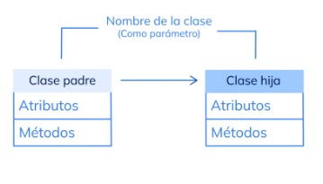

# Python

Aprender todo lo basico de python. 
aqui voy ha realizar ejercicios simples y practicos para aprender a un nuevo lenguajes de programacion

Y aprender a utilizar correctamente el github con distintos entornos
los comando mas utilisados:
git branch "nombre de la nueva rama" -> es para crear una nueva rama.

git merge "nombre de la rama que se va unir"-> es para unir las ramas para hascer esto es nesesario estar en el rama master

git checkout  "nombre de la rama"-> es para cambiar de rama

git add .-> es para añadir todos los archivos 

git commit -m "" -> es para hacer los commit.

git pull -> siempre se debe hacer un pull antes de push. es para verificar si hay cambios 

git push -> es para subir los cambios realizados.

### actividad_operaciones 

aqui se realizan operaciones aritmeticas basicas: 
suma, resta, multiplicacion, division. tambien aperaciones logicas
mayo que, menor que, igual que...
ademas se aprende a ingresar valores por consola.
input() es una funcion en la que python espera la entrada en teclado y luego se presione enter.

### condicionales 
en una condición no puede haber mas de 2 else, si puede tener condicionales anidados
se utiliza el if, else y elif que es equivalente a (else if(){}) de java 

### operaciones de asignacion
tiene las misma funciones que en java la diferencia esta en que hay mas tipos de asignaciones
/=
%=
*=
-=
+= 
### las funciones
len es longitud de un elementos.
python tiene muchas funciones pre-definidas como len.
las funciones se definen con la palabra reservada
*def* 
la estructura es: **def** nombre_de_la_función (parámetros).

una función es un bloque de código que se puede ejecutar múltiples veces,
su veneficio es recorta la cantidad de líneas, además mejora la depuración del código.
se puede poner valores por deafult cuando envias parametros, con esta sintaxys 
def resta(a=none, b= none):

#### funciones con parámetros especiales o posicionales.
En los lenguajes de programación de alto nivel, al declarar una función podemos definir una serie de parámetros con los que invocar dicha función
pero por regla general el numero y nombre de los parámetros en inmutable(no se puede cambiar).
*args se usa para pasar de forma opcional distintos valores. por convención, por lo que puede ir otro nombre pero * si es necesario.
los argumentos deben ser pasados como una **dupla**.
las duplas: Es similar a una tupla, pero con solo dos elementos. Las duplas se utilizan para representar pares ordenados de datos
ejemplos las cooredenadas (x,y).

ejemplo sin el *args
def información (nombre, apellido, edad, dirección, país)

ejemplo con *args
def información (*args)

los kwargs pasan la informacion como un diccionario.
**Kwargs: es lo mismo que el args con la diferencia que las variables tiene nombres. "es recomendable utilizarlo  cuando se trabaja con base de datos. "
 se utiliza los pares de clave-valor. ejemplo
ejemplo:
def informacion (**kwargs)
## Estructura de datos

### Listas
algunos metodos de la lista es append(),es te medodo agrega elementos a la listas.
el metodo sort() que organiza la lista de menor a mayor

### Tuplas
Las tuplas en Python son muy similares a las listas, pero con dos diferencias. **Son inmutables** , lo que significa que no pueden ser modificadas una vez declaradas, y en vez de inicializarse con corchetes se hace con (). Dependiendo de lo que queramos hacer, las tuplas pueden ser más rápidas.
La gran ventaja que ofrecen las tuplas es el poco espacio que ocupan en memoria, dado que al ser inmutables, no necesitan reservar espacio adicional, como en el caso de las listas.
Las tuplas ofrecen el método count para contar los elementos e index para devolver el índice de un elemento.

### Diccionarios
Un diccionario en Python es una colección de elementos, donde cada uno tiene una llave key y un valor value. Los diccionarios se pueden crear con paréntesis {} separando con una coma cada par key: value.
Debes saber que los diccionarios son flexibles, tanto que podemos utilizar distintas formas para crearlos. Además, contiene métodos para insertar, limpiar, eliminar y devolver llaves y valores en forma de listas.
Para concluir esta clase, los diccionarios son mutables, es decir, es posible modificar su longitud, podemos agregar o quitar elementos de él; de igual forma, todos los valores almacenados en el diccionario pueden ser modificados.
A diferencias de las listas y de las tuplas los diccionarios no se rigen por la regla de los índices, todos los valores que se almacenen en el diccionario no corresponden a un índice, sino a una llave.
el DICT es un constructor

### conjuntos 

En Python, un conjunto es una estructura de datos que almacena elementos desordenados. Los elementos del conjunto tampoco están indexados. 
Como una lista, un conjunto permite la adición y eliminación de elementos. Sin embargo, hay algunas características únicas 
que definen un conjunto y lo separan de otras estructuras de datos:
- no puede haber duplicados
- son datos desordenados
- no puede haver una coleccion dentro de un conjunto(como las listas)
para especificar que es un conjunto va la palabra revervada set()
para agregar elementos al conjunto se utiliza eñ add()
 para eliminar elementos se utiliza el metodo discard()y para limpiar el conjunto
se utiliza el clear

## Creacion de Clases
la palabra clave para la clases es *class*.
Es lo mismo que en java solo que aqui hay un metodo en especifico 
para inicalizar los atributos que es 
**def__inicial__(self, atributos)**
se utiliza la palabra self como el this, la diferencia es la palabra self
se puede cambiar por otra pero por buena practica no se hace.

también se instancian las clases igual que en java:
hibrida = bicicleta("rojo", 4, 27.5)
manual = bicicleta ("morado", 1, 29)

### Encapsulamiento
el encapsulamiento posee las siguientes características:
el encapsulamiento hace referencia a la capacidad que tiene un objeto de ocultar su estado, de manera que sus datos solo se puedan modificar por los métodos accesores.

 

La encapsulación consiste en denegar el acceso a los atributos y métodos internos de la clase desde el exterior. En Python no existe, pero se puede simular precediendo atributos y métodos con dos barras bajas __ como indicando que son "especiales".

 

En el siguiente ejemplo tenemos la clase llamada Empleado, después entre paréntesis colocamos self, nombre y salario, y debajo asignamos self.nombre = nombre, self.proyecto = proyecto, self.salario = salario

### Herencia

La Herencia es la característica de los lenguajes orientados a objetos, que le permite a una clase (llamada la subclase o la clase hijo) heredar todos los miembros de otra (llamada la superclase o la clase padre).

### polimorfismo 
El término polimorfismo tiene origen en las palabras poly (muchos) y morfo (formas), y aplicado a la programación hace referencia a que los objetos pueden tomar diferentes formas. ¿Pero qué significa esto?
Pues bien, significa que objetos de diferentes clases pueden ser accedidos utilizando la misma interfaz, mostrando un comportamiento distinto (tomando diferentes formas) según cómo sean accedidos.
Cabe resaltar, que la técnica de polimorfismo de la POO significa la capacidad de tomar más de una forma. Una operación puede presentar diferentes comportamientos en diferentes instancias. El comportamiento depende de los tipos de datos utilizados en la operación. 

### seguridad
(__)privado
(_)protegido
para acceder a estas variables se utiliza set y get, creando metodos como en java
pero hay una manera que es mas estilo python 
se crea una funcion con el nombre de la variable
y para desirle que es un get se utiliza el property ejemplo:

________________________________
esto permite que se pueda aceder mas rapido
@property <-- esto indica que es un get 
def ejemplo(self):
  return self.__ejemplo
_______________________________________
metodo set
@ejemplo.sett
def ejemplo(self, valor):
 self.__ejemplo = valor